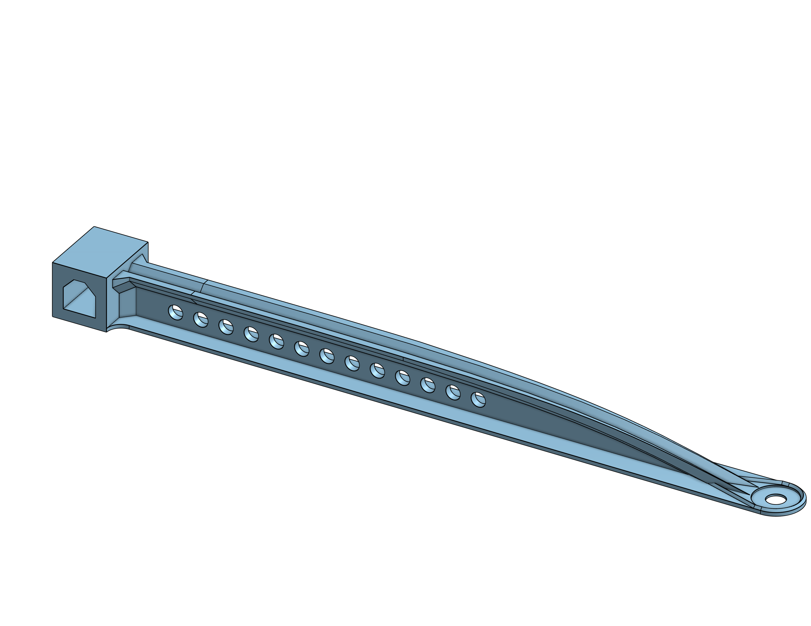
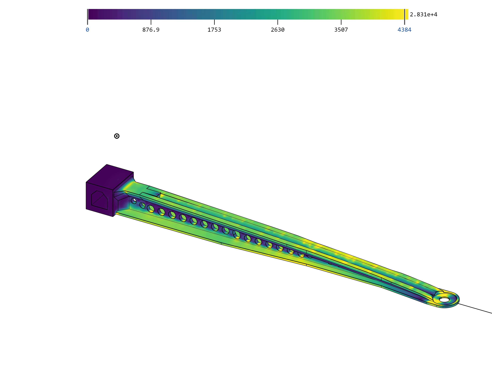
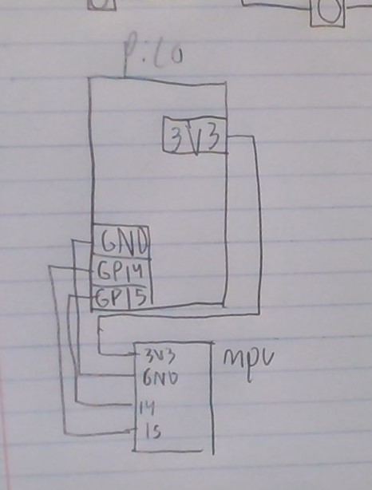
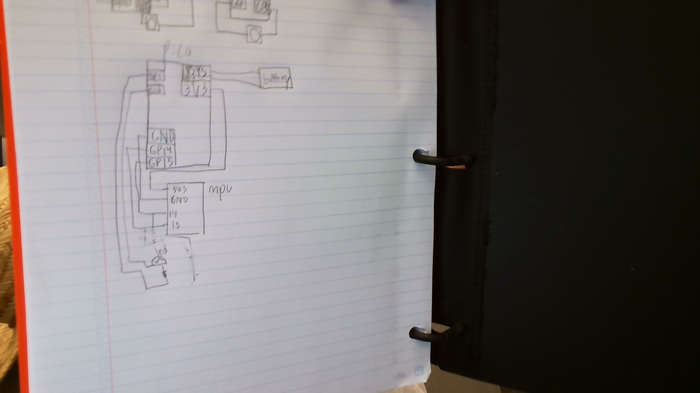
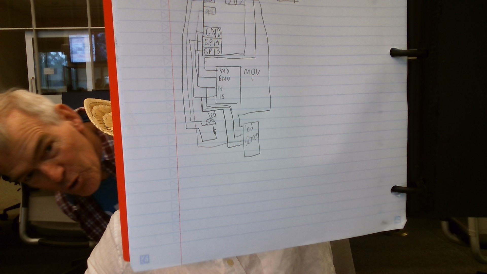
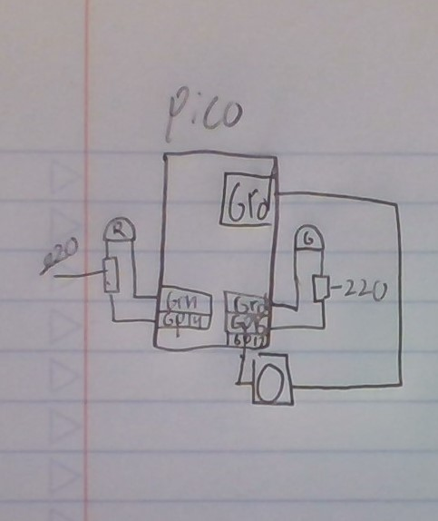
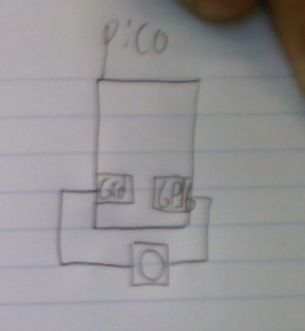
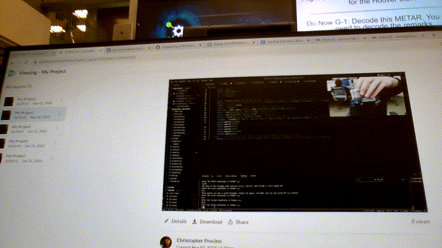

# Engineering_4_Notebook

&nbsp;

# Table of Contents
* [launchpad](#launchpad)
* [Raspberry_Pi_Assignment_Template](#raspberry_pi_assignment_template)
* [Crash Avoidance](#Avoidance)
* [beam](#beam)
* [landing_gear](#landing)
* [morsecode](#morsecode)

&nbsp;
# beam 

### Assignment Description

The first onshape design of the year was part of a contest; design a beam that could support the most weight hanging from one end. The beam used a prebuilt anchor. The beam had to be 180 mm long and have a 12mm hole at the end for the weight to hang from. The design could not use any support material when printing so no part of the design could have an overhang greater than 45 degrees. Our design utilized an I-Beam-like shape that tapered down towards the end of the beam. The I-Beam used 45 rather than 90-degree angles to prevent overhangs. Holes were also created to make sure the beam was under the 13-gram requirement.
## beam 1
### Assignment Description

this is the first one and we did it without any FEA
### Evidence 

  

### Reflection

We began by looking at the winning design from the previous year as a basis for our design. Tomas Slinglove and Nathaniel had a design that used a lot of chamfers and triangles but after looking at ideal beam theory we realized that a curve would be better. With a cantilever beam , if a force is applied at the end, the stress of the beam increases as you get farther from the force point. So the beam must taper as it gets closer to the end to account for that. With the added research we put in we created a I-beam design with a downward curve. We also added holes throughout the beam to reduce weight.
here is the link: https://cvilleschools.onshape.com/documents/a0f454c861c2691786377fa6/w/1d6220f831f8dcc8ccb014d1/e/326089d5b23fb66986b4e29d
&nbsp;

## beam 2
### Assignment Description

After designing our first beam we used onshapes built-in simulation tools to improve our initial design. After redesigning our beam it was tested and then the process of redesign and testing was repeated an additional time. The FEA simulation was run using a force of 30 newtons for consistent results and the force was applied on the mounting face.
### Evidence 

  

### Reflection

After running FEA on our original design we found that our I-beam was thicker and stronger than necessary, but the tip of our beam was too weak and would snap off. For this beam, we used what we had found in the previous beam and perfect beam theory to greatly modify our old beam. We made the curve of the beam far less and strengthened the mounting area. The reasoning behind this was to prevent the beam from breaking where it mounts to the anchor block and prevent the tip from breaking off. The FEA seemed to say that we would break at the mounting area first but in reality, we broke in the middle. We also failed by bending past 35mm first so for the next one we need to decrease the displacement.
here is the link: [https://cvilleschools.onshape.com/documents/a0f454c861c2691786377fa6/w/1d6220f831f8dcc8ccb014d1/e/326089d5b23fb66986b4e29d](https://cvilleschools.onshape.com/documents/a0f454c861c2691786377fa6/w/1d6220f831f8dcc8ccb014d1/e/943aaf02dd4e55416d91be8d)
&nbsp;

### reflection (in post of test)
While testing our first beam we found that it broke not only in the middle but also horizontally where the upper I meets the base of the beam. To fix this we added braces connecting the base and top of the beam. Throughout the second design, we struggled to find meaningful ways to decrease the displacement, and going into the test Zach was skeptical about how much our beam had actually improved. The beam ended up holding 4.8 kg before displacing an improvement of 1.3 kg. We think this was due to inaccuracies in the FEA and the fact that Chris loaded the weights faster. This reduced the time the beam was under stress and therefore prevented the beam from gradually growing weaker as small cracks and breaks formed. In conclusion, our beam was very well-designed and strong. We cannot overstate how helpful variables are in designs you are constantly iterating. Use them when you can.
here is the link: [https://cvilleschools.onshape.com/documents/a0f454c861c2691786377fa6/w/1d6220f831f8dcc8ccb014d1/e/326089d5b23fb66986b4e29d](https://cvilleschools.onshape.com/documents/a0f454c861c2691786377fa6/w/1d6220f831f8dcc8ccb014d1/e/943aaf02dd4e55416d91be8d)
&nbsp;

# Avoidance

### Table of Contents

* [Avoidance1](#Avoidance1)
* [Avoidance2](#Avoidance2)
* [Avoidance3](#Avoidance3)

## Avoidance1

### Assignment Description

This assignment was the first of the crash avoidance siries. It introduced us to the MPU6050 Accelerometer and all we had to do was wire it up and have it print out the  X Y and Z values. 
### Evidence 

### wiring diagram
 

### Code
[code](raspberry-pi/avoid1.py).

### Reflection

This assignement introduce me to en entirely new system. The new MPU6050 Accelerometer/Gyro device was new but not difficult to understand and with the wiring for the project provided and the set up was easy. The code wsa a bit harder and required a new coding concept in this class, that being Arrays. This was not too difficult because i had covered them in other CS classes and the new syntax was pretty much the same (mpu.acceleration[0]). I just need to remeber to count from 0.   

## Avoidance2

### Assignment Description

This assignment was the second of the crash avoidance siries. It had us creat a battery powered system that turned on a warning light when it was turned more than 90 degrees 
### Evidence 

### wiring diagram
 

### Code
[code](raspberry-pi/avoid3.py).

### Reflection

this assignment was slightly more difficult, it added two new things for us to do; make a battery powered system and code a system that would turn on a led. The challennge for me was making sure the wiring was correct as the code only needed some if and elif (else if) statements, the wiring required me to use old things on this board like SCL and SDA but also some new things like the VSYS to power the board. Overall this project was still relatively easy but still required some trouble shooting of the LEDS and board to discover the flaws in my wiring and code. The biggest issue for me in this project was making sure that i was uploading code in the right way and that i was use LEDs that work. 

## Avoidance3

### Assignment Description

This assignment was the third of the crash avoidance siries. It had us create a battery powered system that had all the previous requierments of the the last assignment plus display the data on a mini led screen. 
### Evidence 

### wiring diagram
 
 please enjoy the photo bomb

### Code
[code](raspberry-pi/avoid3.py).

### Reflection
This was a realatively easy project after I figured out how to use the led screen. I looked over Sam Funks repo (https://github.com/sfunk02/Engineering_4_Notebook#crash_avoidance_part_3) to help me understand some of the formatting on the led screen, but the majority of the code came from the previous project. I then commented the code using ChatGPT to save some busy work but then had to edit it because it made some errors so is had to go over it all again. If i was to do this again I would look at other peoples repos before i started to try and wing the code to the screen (i tried print.screen at one point ) but overall this project was not to bad. 

# launchpad
### Table of Contents
* [launchpad1](#launchpad1)
* [launchpad2](#launchpad2)
* [launchpad3](#launchpad3)
* [launchpad4](#launchpad4)

## launchpad1

### Assignment Description

This was a simple assignment that had us have a code output a countdown from 10 to 0 and say lift off at the end.
### Evidence 

### Code
[code](raspberry-pi/countdown.py).

### Reflection

This was an pretty easy assignment despite my lack of coding ability. The simple trick was making a for loop work in a range where it counted down, I my first iteration I had a for loop run ten times and and inside the for loop I put a simple subtraction and print method. For the later assignments i would change this to a more effiecent system of a for loop in a range of (10, 0, -1). I tried both for this assignment but desided on my first code because i understanded it better. Once i relaerned the syntax of the for loops this was a very achieveble assgnment. 

## launchpad2

### Assignment Description

this was the second in a siries of assignments about coding an countdown to launch for a pico board. This one added on the requierment to have a LED flash during the countdown and a different LED stay on after the countdown reached zero. 

### Evidence 

### wiring diagram
 

### Code
[code](raspberry-pi/launpad2.py).

### Reflection

this assignment made us have a light blink during the countdown, it was relatively easy as i only needed to modify the code before and add some LED code to make this work. As I was behind in work due to sickness it was nice that mason divers could help out with the LED setup code. The simple new thing to learn was ro figure out how to code the pins to the wires as the pico has new syntax. The saving grace was CNRL+P which allows you to open the pin map and then connect the right pins to the right places. Once that was acomplished the assignment was as easy as putting LED equal to true or false inside or out of the loop I had built in in the first assignment. 

## launchpad3

### Assignment Description

This was a assignment that had us have a code output a countdown from 10 to 0 after a button was pressed. 
### Evidence 

### wiring diagram
 

### Code
[code](raspberry-pi/launchpad3.py).

### Reflection

this little trick of coding was very simple, the wiring was about as simple as it comes but the code needed a while loop and to pull up the button but both proved easier than they first seemed. The button pull was the only difficult part as the wiring was extremely easy b/c the picos are more advanced than previous boards. The code needed a while loop to always check an if statement which is still realtively simple but requiered some trial and error. 

## launchpad4

### Assignment Description

this took all three of the last assignments and added them together. We had to have the button activate the countdown and the lights.
### Evidence 

### wiring diagram
 

### Code
[code](raspberry-pi/launchpad4.py).

### Reflection

the final launchpad assignment may have been the easiest as all i needed to do was copy and paste the code from the other ones. the challenge was making sure all the little complex things were in the right place and also repacing a broken button. The engineering challenge was largely just putting all of the stuff on one board and making sure all the wires, LEDs, resistors and the button were properly wired in. The code was just copy pasting the previos code together, and deciding whether or not they were inside the while loop.  

## landing

### Assignment Description

this is a coding assignment that required us to write a function to calculate the area of a triangle base on three points

### Code
[code](raspberry-pi/functions1.py).

### Reflection
this assignment wasn't too bad and only required a few new coding skills. Functions were new to me in circiut python but were not to hard to understand. I need to do more work to write all my code line by line though and not copy paste things from the internet.  

## landing2

### Assignment Description

this is a coding assignment that required us to write a function to calculate the area of a triangle and then put that onto a OLED screen. 
### Evidence 

### Code
[code](raspberry-pi/functions2.py).

### Reflection
This assingment was a bit harder and requiered me to use a few new things and to combine other skills that i had previously learned. The use of the shapes folder and putting a image onto the OLED screen was a little tricky. over all the assignment wasn't to bad and only needed to put a few things together to creat the final project. 

## morsecode

### Assignment Description

this was anj assignment that had us input text and output it as morse code. 

### Evidence 

### Code
[code](raspberry-pi/morsecode.py).

### Reflection
this assignment wasn't too bad and only required a few new coding skills. Functions were new to me in circiut python but were not to hard to understand. I need to do more work to write all my code line by line though and not copy paste things from the internet.  

## Raspberry_Pi_Assignment_Template

### Assignment Description

Write your assignment description here. What is the purpose of this assignment? It should be at least a few sentences.

### Evidence 

Pictures / Gifs of your work should go here. You need to communicate what your thing does. 

### Wiring

This may not be applicable to all assignments. Anything where you wire something up, include the wiring diagram here. The diagram should be clear enough that I can recreate the wiring from scratch. 

### Code
Give me a link to your code. [Something like this](https://github.com/millerm22/Engineering_4_Notebook/blob/main/Raspberry_Pi/hello_world.py). Don't make me hunt through your folders, give me a nice link to click to take me there! Remember to **COMMENT YOUR CODE** if you want full credit. 

### Reflection

What went wrong / was challenging, how'd you figure it out, and what did you learn from that experience? Your goal for the reflection is to pass on knowledge that will make this assignment better or easier for the next person. Think about your audience for this one, which may be "future you" (when you realize you need some of this code in three months), me, or your college admission committee!

&nbsp;
